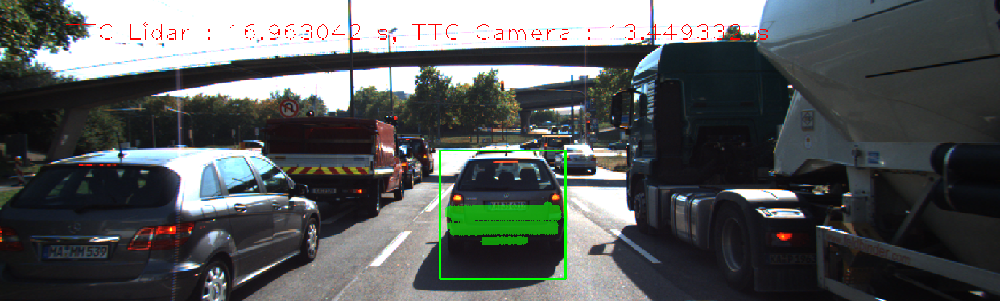
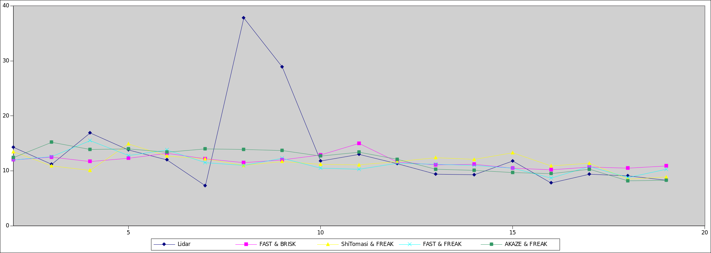

# Track an Object in 3D Space

## FP.0 Final Report

You're reading it.

## FP.1 Match 3D Objects

I implemented `matchBoundingBoxes()` by finding the matches that were in a bounding box both in the previous and current frames. These were tracked by counting each instance where a previous box was matched with a current box. Then, each previous bounding box was mapped to the current bounding box with which it matched the most times.

## FP.2 Compute Lidar-based TTC

I implemented `computeTTCLidar()` by first storing all lidar points from the previous and current frames in sorted sets. Thus the minimum points would be the first in the sets. To prevent outliers from messing up the calculations, I searched through each set until I found a point that was within a tolerance value of the next point.

## FP.3 Associate Keypoint Correspondences with Bounding Boxes

I implemented `clusterKptMatchesWithROI` by finding all matches that were contained in the given bounding box. Then I calculated the mean of the matches distances and only kept matches whose distance was within a tolerance of the mean.

## FP.4 Compute Camera-based TTC

In `computeTTCCamera()`, I computed the distance ratios between all matched keypoints. To deal with outlier data, I used the median of all the distance ratios for the TTC calculation.

## FP.5 Performance Evaluation 1

On the 4th frame, there are several lidar points that are outliers from the rest of the lidar points but are very close to each other. As a result, these points may have fooled my outlier detection which only checks the closest point to the minimum.

The 7th and 8th frames both have poor lidar TTC calculations due to the lidar detection on the 7th frame being closer to ego than reality. This appears to be due to pattern in the lidar point cloud where the right side of the car slopes closer to ego. Because all of the points are still close to one another, they will also fool my outlier detection. However, this one would be tricky to resolve since there is no place where the difference between 2 consecutive points is large. Possibly a strong outlier detection would find multiple minimum lidar points along the y axis and then use the median of those points for its TTC calculation.

## FP.6 Performance Evaluation 2

Below is a table of all observed TTC values using different detector and descriptor combinations. Notice the large number of invalid results for the Harris and ORB detectors, which is due to these detectors returning a smaller number of keypoints to match and compare.

| Combination | 2 | 3 | 4 | 5 | 6 | 7 | 8 | 9 | 10 | 11 | 12 | 13 | 14 | 15 | 16 | 17 | 18 | 19 |
| --- | --- | --- | --- | --- | --- | --- | --- | --- | --- | --- | --- | --- | --- | --- | --- | --- | --- | --- |
| ShiTomasi & BRISK | 17 | 11.8 | 13.4 | 11.8 | 14.5 | 17.9 | 12.8 | 19 | 10.1 | 13.9 | 10.7 | 12.6 | 11.3 | 10.1 | 8.5 | 11.1 | 8.3 | 8.1 |
| ShiTomasi & BRIEF | 12.3 | 14 | 9 | -inf | 14.4 | 9.2 | -113.9 | 11.2 | 10.5 | 16.5 | 8 | 12.6 | 11.2 | 13 | 6.9 | 19.9 | 14.3 | 7.4 |
| ShiTomasi & ORB | 16.1 | 11.1 | 8.9 | 18 | 11.2 | 13.2 | 10.5 | 12.5 | 12.5 | 15.5 | 11.1 | 12 | 9.8 | 10.9 | 7.8 | 10.6 | 7.7 | 6.7 |
| ShiTomasi & FREAK | 13.5 | 10.9 | 10.1 | 14.9 | 12.7 | 12.2 | 11 | 11.7 | 11.2 | 11.1 | 11.7 | 12.4 | 12.1 | 13.3 | 10.9 | 11.4 | 8.5 | 8.9 |
| ShiTomasi & SIFT | 21.1 | 12.4 | 11.3 | 12.5 | 17.6 | 12.8 | 13.9 | 18.3 | 11.2 | 13.3 | 14.5 | 12.5 | 10.2 | 7.6 | 10.2 | 10.9 | 7.5 | 8 |
| Harris & BRISK | 10.9 | nan | -10.2 | 10.8 | -82.1 | 13.9 | 21.5 | 10.3 | nan | nan | 11.8 | 12.5 | nan | nan | -12.3 | 6 | 12.6 | nan |
| Harris & SIFT | 21.8 | nan | nan | nan | nan | nan | -21.5 | 34.1 | nan | nan | nan | nan | nan | nan | 37.6 | nan | nan | nan |
| FAST & BRISK | 12 | 12.5 | 11.7 | 12.3 | 13.2 | 12.2 | 11.5 | 12 | 12.9 | 15 | 11.6 | 11.1 | 11.2 | 10.5 | 10.2 | 10.7 | 10.5 | 10.9 |
| FAST & BRIEF | 11.8 | 10.5 | 17 | 16 | 44.3 | 13.3 | 11.2 | 11.1 | 9 | 15.4 | 12.9 | 8.6 | 11.8 | 11 | 11.7 | 10.5 | 9.3 | 12.8 |
| FAST & ORB | 12.1 | 11.5 | 11 | 14.9 | 13.7 | 12.9 | 11.7 | 11.8 | 12.4 | 12.7 | 11.3 | 11.5 | 10.6 | 10.5 | 10.1 | 8 | 10.3 | 12.9 |
| FAST & FREAK | 12 | 12.6 | 15.5 | 12.8 | 13.8 | 11.5 | 11 | 12.3 | 10.5 | 10.3 | 11.4 | 11.2 | 11 | 10.5 | 8.7 | 10.8 | 8.8 | 10.3 |
| FAST & SIFT | 12.5 | 11.3 | 16.3 | 14.2 | 15.5 | 12.6 | 11.8 | 11.6 | 10.8 | 18.6 | 10.8 | 11.5 | 9.7 | 11.1 | 9.7 | 10.1 | 9.2 | 11.9 |
| BRISK & BRISK | 10.7 | 16 | 9.5 | 19.2 | 30.7 | 13.9 | 11.9 | 40.2 | 13.2 | 9.5 | 11.9 | 8.4 | 12.5 | 10.2 | 15 | 11 | 8.5 | 10.4 |
| BRISK & BRIEF | 14 | 14.8 | 14.7 | 16.9 | 33.3 | 26.8 | 12.9 | 14.1 | 9.9 | 14.1 | 11 | 17.9 | 11.1 | 11.5 | 11.5 | 11.5 | 9.5 | 12.3 |
| BRISK & ORB | 13.8 | 15.3 | 11.5 | 18.9 | 20 | 16.1 | 13.1 | 15.6 | 16.6 | 15 | 12.3 | 12.3 | 11.2 | 11.1 | 10.4 | 9.5 | 9.3 | 9.7 |
| BRISK & FREAK | 12 | 16.9 | 12.3 | 17.7 | 21 | 15.8 | 17 | 16 | 11.8 | 11.6 | 11.8 | 10.7 | 10.9 | 10.8 | 14.8 | 8.5 | 7.2 | 10.1 |
| BRISK & SIFT | 7 | 8 | 13.3 | 6.9 | 17.4 | 8.1 | 10 | 12.7 | 18.6 | 16.1 | 21.3 | 17.7 | 13.6 | 11 | 19.6 | 9.1 | 10.9 | 12 |
| ORB & BRISK | 8.3 | 45.2 | 6.9 | nan | 493.5 | 70.2 | 15.9 | -30.8 | 5.1 | 3.6 | 7.9 | -23.8 | 4.8 | 2.7 | nan | 7.3 | 32.2 | 11.3 |
| ORB & SIFT | nan | 27.8 | 25.4 | -18 | 98.5 | 75 | 8.7 | 5.5 | 5.6 | 5.5 | 9.4 | -1.7 | 6.6 | 10.8 | 14.1 | 6.3 | 6 | -91.3 |
| AKAZE & BRISK | 11.9 | 13.7 | 12.9 | 14 | 14.3 | 14.8 | 14.9 | 14.4 | 13.5 | 11.7 | 12.2 | 10.1 | 10.2 | 10.5 | 9.8 | 11.6 | 10.7 | 8.7 |
| AKAZE & BRIEF | 10.7 | 16.1 | 12.5 | 13.8 | 14.7 | 14.9 | 14.4 | 13.7 | 13.5 | 11.4 | 12.7 | 9.9 | 9.3 | 9.9 | 9.7 | 8.7 | 9.8 | 9.2 |
| AKAZE & ORB | 15 | 14.6 | 12.3 | 14.2 | 16.2 | 16.2 | 16.3 | 13.5 | 14 | 12.1 | 11.8 | 10.9 | 9 | 9 | 9.9 | 9.7 | 8.3 | 8.6 |
| AKAZE & FREAK | 12.4 | 15.2 | 13.9 | 14 | 13.4 | 14 | 13.9 | 13.7 | 12.7 | 13.4 | 12.1 | 10.3 | 10.1 | 9.7 | 9.5 | 10.3 | 8.2 | 8.3 |
| AKAZE & AKAZE | 13.7 | 11.8 | 12.2 | 11.9 | 14.3 | 12.3 | 13.3 | 13.9 | 12.7 | 11.5 | 11.3 | 11.9 | 10.5 | 9.7 | 11.9 | 9.2 | 9 | 8.4 |
| AKAZE & SIFT | 13.1 | 15.7 | 12 | 14.2 | 13.1 | 12.1 | 18.6 | 12.3 | 15.4 | 12.5 | 11.1 | 11.3 | 10.4 | 9.7 | 9.4 | 10.7 | 8 | 10.4 |
| SIFT & BRISK | 9.4 | 13.8 | 14.7 | 19.6 | 12.7 | 10 | 16.2 | 12.2 | 12.7 | 14.8 | 11 | 9.1 | 8.4 | 10.2 | 9.1 | 7.7 | 9.4 | 8.4 |
| SIFT & BRIEF | 12.1 | 11.3 | 31 | 1081.4 | -9399.86 | 7.9 | 13.6 | 14.1 | 12.1 | 7.9 | 9.5 | 10.2 | 14.2 | 7.8 | 11.4 | 8 | 8.5 | 10 |
| SIFT & FREAK | 11.1 | 12.4 | 13.5 | 20.5 | 13.3 | 11.2 | 14 | 9.7 | 12.9 | 11.1 | 9.1 | 9.5 | 9 | 8.5 | 8.6 | 9.8 | 8.4 | 7.7 |
| SIFT & SIFT | 10.9 | 11.7 | 13.5 | 26.1 | 12.8 | 12.1 | 14.2 | 14.1 | 15.9 | 11.2 | 12.5 | 9.9 | 9.8 | 10.5 | 8.9 | 9.3 | 8.6 | 9.4 |

Below is a graph visualizing the TTC results from lidar and the top 4 results from camera:

